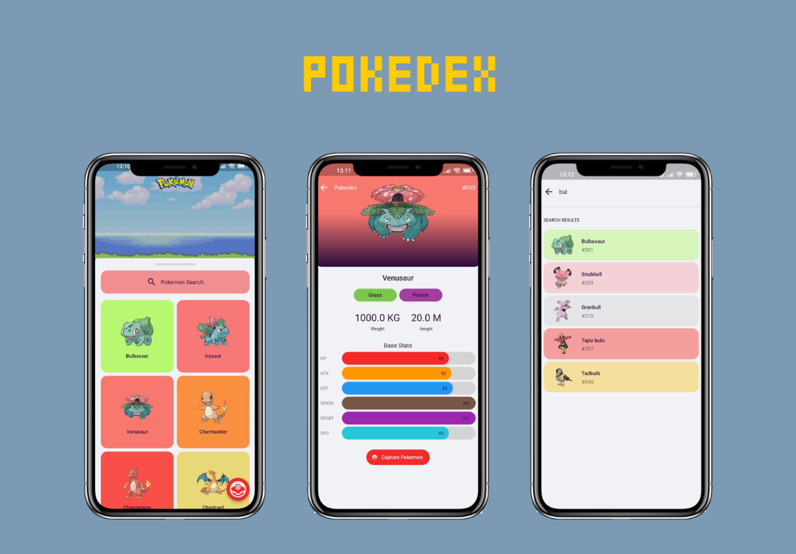
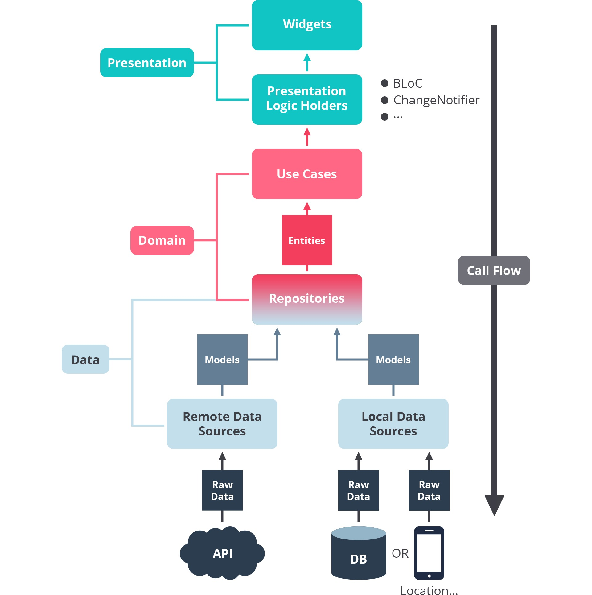

<table align="center"><tr><td align="center" width="9999">

# **Pokedex F**

<a href="https://opensource.org/licenses/Apache-2.0">
  
</a>
<a href="https://android-arsenal.com/api?level=16">
  
</a>
<a href="https://github.com/FarhanFDjabari/PokedexF/actions">
  
</a> <br>
<a href="https://github.com/FarhanFDjabari">
  
</a>

Application that shows pokemon list from PokeApi built with Flutter that demonstrates clean architecture using BLoC pattern and motion layout
</td></tr></table>

<p align="center"> 
  
</p>


## Open Source Libraries

- Minimum SDK level 16
- Architecture
  - [BLoC](https://bloclibrary.dev/) (Business Logic Component)
  - [Injectable](https://pub.dev/packages/injectable): Convenient code generator for get_it.
  - [GetIt](https://pub.dev/packages/get_it): Simple direct Service Locator to decouple interfaces and access the implementation from everywhere.
  - Repository pattern
- [Retrofit](https://pub.dev/packages/retrofit): Retrofit is an dio client generator to generate api services module.
- [Dio](https://pub.dev/packages/dio): A powerful HTTP package for Dart/Flutter
- Custom Views
  - [Animations](https://pub.dev/packages/animations): Fancy pre-built animations that can easily be integrated into any Flutter application.
  - [Animation Progress Bar](https://pub.dev/packages/flutter_animation_progress_bar): Show an animation progress bar in reactive style.
- [Floor](https://pub.dev/packages/floor): The typesafe, reactive, and lightweight runtime dependency SQLite abstraction for Flutter applications.
- [Infinite Scroll Pagination](https://pub.dev/packages/infinite_scroll_pagination): Lazily load and display pages of items as the user scrolls down your screen
- [Go Router](https://pub.dev/packages/go_router): A declarative router for Flutter based on Navigation 2
- [Lottie](https://pub.dev/packages/lottie): Render After Effects animations natively on Flutter.
- [Freezed](https://pub.dev/packages/freezed): Code generation for immutable classes that has a simple syntax/API without compromising on the features.
- [ScreenUtil](https://pub.dev/packages/flutter_screenutil): A flutter plugin for adapting screen and font size.
- [Dartz](https://pub.dev/packages/dartz): Functional Programming in Dart using efficient immutable data structures, monads, lenses and other FP tools.

## Architecture

**Pokedex F** is based on the BLoC architecture that implements the Repository pattern, which follows the [Official BLoC architecture documentation](https://bloclibrary.dev/#/architecture)



The overall architecture of this app is composed of Presentation/App layer, Domain layer, and Data layer. Each layer has its dedicated components and responsibilities.

### Presentation / App Layer

Presentation / App layer consists of UI elements such as widgets to configure screens that can interact with the users and state management BLoC as app logic and states holder.

### Domain Layer

Domain layer consists of core elements that are related to the business processes of the app. These elements include business data (entities) and business logic (use cases), as well as the abstraction of repository objects that communicate with other layers to obtain data from data sources and provide it to the users.

### Data Layer

Data layer consists of the repository implementation and the data sources, which include local (database) and remote (API) data sources. This layer communicates with the domain layer to send response data to the presentation layer using the Dependency Inversion Principle.

## REST API


Pokedex using the [PokeAPI](https://pokeapi.co/) for constructing RESTful API.<br>
PokeAPI provides a RESTful API interface to highly detailed objects built from thousands of lines of data related to Pokémon.

## Installation Guide

- Check if the flutter SDK and the version is v3.7.3 or higher. [Instruction to change flutter channel](https://github.com/flutter/flutter/wiki/Flutter-build-release-channels#how-to-change-channels).

- Clone the repo

  ```sh

  git clone https://github.com/FarhanFDjabari/PokedexF.git

  ```

- Get the pubspec packages

  ```sh
  flutter pub get
  ```

- Some files like `*.freezed.dart`, `*.g.dart` are auto generated. If there is any issue from these files just run this command to regenerate them.

  ```sh
  flutter pub run build_runner build --delete-conflicting-outputs
  ```

- Run the app

  ```sh
  flutter run
  ```

## Special Thanks

- I want to mention Jaewoong Eum ([skydoves](https://github.com/skydoves)) for inspiring me to work on this repository. [His project](https://github.com/skydoves/Pokedex) has been a huge inspiration and learning experience for me. Please check out his [repo](https://github.com/skydoves?tab=repositories) too! I'm sure you'll find it helpful.
- Authors of all the packages I have used, who made our lives easier.

## Like This Repository?

If you found my work helpful, please consider supporting me by starring this [repository](https://github.com/FarhanFDjabari/PokedexF/stargazers) and follow my [GitHub](https://github.com/FarhanFDjabari). Your support will motivate me to create more project and improve my skills. Thanks!

# License

```xml
Designed and developed by 2023 FarhanFDjabari

Licensed under the Apache License, Version 2.0 (the "License");
you may not use this file except in compliance with the License.
You may obtain a copy of the License at

   http://www.apache.org/licenses/LICENSE-2.0

Unless required by applicable law or agreed to in writing, software
distributed under the License is distributed on an "AS IS" BASIS,
WITHOUT WARRANTIES OR CONDITIONS OF ANY KIND, either express or implied.
See the License for the specific language governing permissions and
limitations under the License.
```
